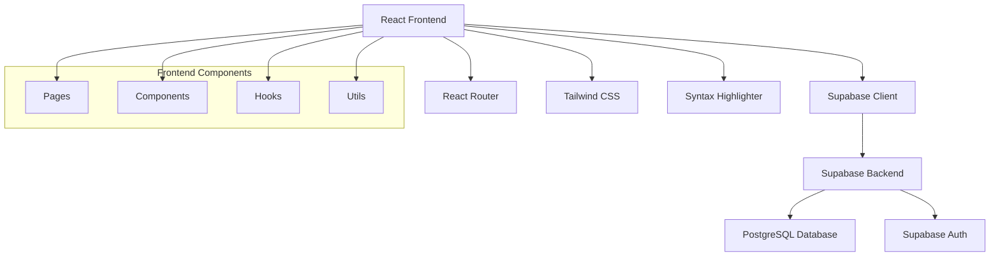

# Design Document

## Overview

Sniplet is a React-based Code Snippet Marketplace that leverages modern web technologies to provide a seamless developer experience. The application is built using React 19 with Vite as the build tool, Tailwind CSS for styling, React Router for navigation, and Supabase for backend services including authentication and data storage. The architecture follows React best practices with functional components, hooks, and a component-based design pattern.

## Architecture

### High-Level Architecture



### Technology Stack

- **Frontend Framework**: React 19 with functional components and hooks
- **Build Tool**: Vite for fast development and optimized builds
- **Routing**: React Router DOM for client-side navigation
- **Styling**: Tailwind CSS for utility-first styling
- **Authentication**: Supabase Auth with email/password
- **Database**: Supabase (PostgreSQL) for data persistence
- **Syntax Highlighting**: React Syntax Highlighter or Prism.js
- **Form Handling**: React Hook Form for form validation and management
- **State Management**: React Context API and local component state

## Components and Interfaces

### Page Components

#### 1. Landing Page (`/`)
- **Purpose**: Welcome users and showcase featured snippets
- **Components**: Hero section, featured snippets grid, navigation
- **Data**: Fetches top-rated or recently added snippets
- **State**: Featured snippets list, loading state

#### 2. Snippet Feed (`/snippets`)
- **Purpose**: Browse all snippets with search and filtering
- **Components**: Search bar, filter sidebar, snippet cards, pagination
- **Data**: All snippets with metadata, tags, and languages
- **State**: Snippets list, search query, active filters, pagination

#### 3. Snippet Detail (`/snippets/:id`)
- **Purpose**: Display full snippet with syntax highlighting and interactions
- **Components**: Code block, metadata, rating system, copy button
- **Data**: Complete snippet data, user ratings, author information
- **State**: Snippet data, user rating, copy status

#### 4. Upload Snippet (`/upload`)
- **Purpose**: Form for authenticated users to submit new snippets
- **Components**: Multi-step form, code editor, tag selector, preview
- **Data**: Form data, available tags, programming languages
- **State**: Form values, validation errors, submission status

#### 5. User Profile (`/profile/:userId`)
- **Purpose**: Display user information and their snippets
- **Components**: User info card, snippets grid, edit/delete actions
- **Data**: User profile, user's snippets, user's ratings
- **State**: Profile data, user snippets, edit mode

#### 6. Authentication Pages (`/login`, `/register`)
- **Purpose**: User authentication flows
- **Components**: Login form, registration form, error handling
- **Data**: Form validation, authentication state
- **State**: Form values, validation errors, auth status

### Shared Components

#### Navigation Component
```jsx
// Navigation with authentication-aware menu
<Navigation>
  <Logo />
  <SearchBar />
  <UserMenu authenticated={isAuthenticated} />
</Navigation>
```

#### Snippet Card Component
```jsx
// Reusable snippet preview card
<SnippetCard>
  <SnippetHeader title={title} language={language} />
  <CodePreview code={code} language={language} />
  <SnippetMeta author={author} rating={rating} tags={tags} />
</SnippetCard>
```

#### Code Block Component
```jsx
// Syntax-highlighted code display
<CodeBlock>
  <SyntaxHighlighter language={language} code={code} />
  <CopyButton code={code} />
</CodeBlock>
```

### Custom Hooks

#### useAuth Hook
```jsx
// Authentication state management
const useAuth = () => {
  const [user, setUser] = useState(null);
  const [loading, setLoading] = useState(true);
  
  return {
    user,
    loading,
    signIn,
    signUp,
    signOut
  };
};
```

#### useSnippets Hook
```jsx
// Snippet data fetching and management
const useSnippets = (filters) => {
  const [snippets, setSnippets] = useState([]);
  const [loading, setLoading] = useState(false);
  
  return {
    snippets,
    loading,
    createSnippet,
    updateSnippet,
    deleteSnippet
  };
};
```

## Data Models

### Snippet Model
```typescript
interface Snippet {
  id: string;
  title: string;
  description: string;
  code: string;
  language: string;
  tags: string[];
  author_id: string;
  author_name: string;
  created_at: string;
  updated_at: string;
  rating_average: number;
  rating_count: number;
}
```

### User Model
```typescript
interface User {
  id: string;
  email: string;
  username: string;
  created_at: string;
  avatar_url?: string;
}
```

### Rating Model
```typescript
interface Rating {
  id: string;
  snippet_id: string;
  user_id: string;
  rating: number; // 1-5 stars
  created_at: string;
}
```

### Database Schema (Supabase)

#### snippets table
- id (uuid, primary key)
- title (text, not null)
- description (text)
- code (text, not null)
- language (text, not null)
- tags (text array)
- author_id (uuid, foreign key to auth.users)
- created_at (timestamp)
- updated_at (timestamp)

#### ratings table
- id (uuid, primary key)
- snippet_id (uuid, foreign key to snippets)
- user_id (uuid, foreign key to auth.users)
- rating (integer, 1-5)
- created_at (timestamp)

#### profiles table
- id (uuid, primary key, foreign key to auth.users)
- username (text, unique)
- avatar_url (text)
- created_at (timestamp)

## Error Handling

### Client-Side Error Handling
- **Network Errors**: Display user-friendly messages for connection issues
- **Authentication Errors**: Redirect to login with appropriate error messages
- **Validation Errors**: Show field-specific validation messages
- **404 Errors**: Custom not found pages for missing snippets/users
- **Permission Errors**: Clear messaging when users lack permissions

### Error Boundary Implementation
```jsx
class ErrorBoundary extends React.Component {
  constructor(props) {
    super(props);
    this.state = { hasError: false };
  }

  static getDerivedStateFromError(error) {
    return { hasError: true };
  }

  render() {
    if (this.state.hasError) {
      return <ErrorFallback />;
    }
    return this.props.children;
  }
}
```

### Supabase Error Handling
- **Database Errors**: Handle constraint violations and connection issues
- **Auth Errors**: Manage expired sessions and invalid credentials
- **Rate Limiting**: Implement retry logic with exponential backoff

## Testing Strategy

### Unit Testing
- **Components**: Test rendering, props handling, and user interactions
- **Hooks**: Test custom hooks with React Testing Library
- **Utilities**: Test helper functions and data transformations
- **Forms**: Test validation logic and submission handling

### Integration Testing
- **Authentication Flow**: Test login, registration, and logout processes
- **CRUD Operations**: Test snippet creation, reading, updating, and deletion
- **Search and Filtering**: Test search functionality and filter combinations
- **Navigation**: Test routing and page transitions

### End-to-End Testing
- **User Journeys**: Test complete user workflows from registration to snippet creation
- **Cross-Browser**: Ensure compatibility across modern browsers
- **Responsive Design**: Test on various screen sizes and devices

### Testing Tools
- **Jest**: Unit testing framework
- **React Testing Library**: Component testing utilities
- **MSW (Mock Service Worker)**: API mocking for tests
- **Cypress or Playwright**: End-to-end testing (optional)

## Performance Considerations

### Code Splitting
- Implement route-based code splitting with React.lazy()
- Split large components and libraries into separate chunks
- Lazy load syntax highlighting languages

### Data Fetching Optimization
- Implement pagination for snippet feeds
- Use Supabase's built-in caching mechanisms
- Implement optimistic updates for better UX

### Bundle Optimization
- Tree shaking for unused code elimination
- Optimize images and assets
- Use Vite's built-in optimizations

### Caching Strategy
- Browser caching for static assets
- Supabase query caching for frequently accessed data
- Local storage for user preferences and temporary data

## Security Considerations

### Authentication Security
- Use Supabase's built-in security features
- Implement proper session management
- Secure route protection for authenticated pages

### Data Validation
- Client-side validation for user experience
- Server-side validation through Supabase RLS policies
- Input sanitization for code snippets and user content

### XSS Prevention
- Proper escaping of user-generated content
- Safe rendering of code snippets
- Content Security Policy headers

## Accessibility

### WCAG Compliance
- Semantic HTML structure
- Proper ARIA labels and roles
- Keyboard navigation support
- Screen reader compatibility

### Visual Accessibility
- High contrast color schemes
- Scalable fonts and UI elements
- Focus indicators for interactive elements
- Alternative text for images and icons